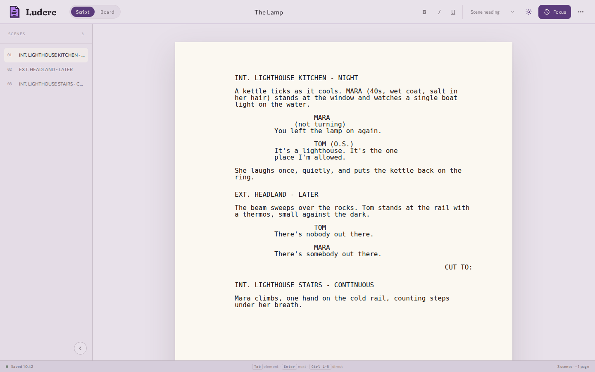
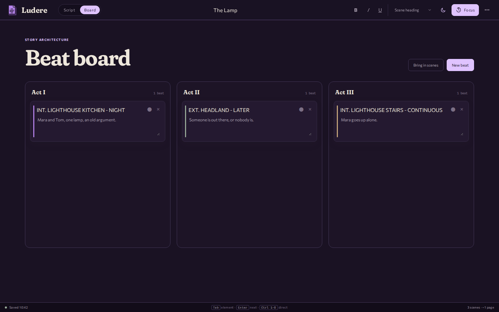

<p align="center"></p>

# Ludere

Screenplay formatting that autosaves as you write.

Ludere is a local screenplay editor with a scene rail and a three-act beat board. The page follows
Letter-sized screenplay margins in Courier; the surrounding app stays out of the way.

Current version: **0.1.0**.





## Open it

Instrumenta installs and launches Ludere. For direct development, from a checkout (Node.js 20 or newer):

```bash
npm run dev
```

The dev server listens on `http://127.0.0.1:4174`; set `PORT` to change it.

Ludere is a static application with no runtime framework dependency. `npm run build` copies the
packageable files to `dist/`.

## Writing behavior

Enter follows the current screenplay element:

```text
scene heading → action
character → dialogue
parenthetical → dialogue
```

Empty action and dialogue lines switch to the next likely element. Ludere also recognises `INT.`,
`EXT.`, common transitions, uppercase character cues, and dialogue parentheticals while typing or
pasting multiple lines.

Useful controls:

- Tab and Shift+Tab cycle through the eight screenplay elements.
- Ctrl/Cmd+1–8 selects an element directly.
- Ctrl/Cmd+B, I, and U apply inline emphasis.
- Existing character names appear as cue suggestions.
- The scene rail jumps through headings.
- Undo keeps 200 steps.
- Focus sprints count forward and leave the document alone when they end.

The beat board imports scene headings, adds free beats, colours them, and moves them between acts.

## Files and exports

Ludere saves portable `.ludere` JSON and opens `.ludere`, JSON, and Final Draft `.fdx`. It exports:

- Final Draft `.fdx`;
- industry-indented plain text;
- standalone printable HTML;
- print/PDF through the browser.

Optional title-page fields cover author, source line, contact, and draft/date.

Browser autosave and recovery stay in local storage. There is no account or telemetry. Your
screenplay has avoided acquiring a customer-success manager.

## MCP control

`npm run mcp` starts the dependency-free local stdio server. Its 18 tools can:

- create, open, inspect, validate, and search portable projects;
- edit, reorder, or delete screenplay blocks and story beats by stable ID;
- maintain title-page data;
- import plain/Fountain-like text or Final Draft;
- export Ludere JSON, FDX, text, or printable HTML.

Paths are explicit and absolute. New destinations refuse overwrite. In-place edits are atomic.
Optional SHA-256 document tokens reject stale writes.

The MCP server uses the same versioned document shape as the browser. It does not reach into
origin-scoped autosave, undo history, theme, view state, or focus timers.

See [the MCP guide](mcp/README.md) for the tool contracts and examples.

## Instrumenta integration

[`instrumenta/product.json`](instrumenta/product.json) says Ludere is built as `web-static`; the
launcher's catalog delivers it as `managed-web`. Instrumenta serves the built app on Ludere's
registered loopback origin (port 49322) and opens it inside a sandboxed Electron window. A fresh
install opens the copy baked into the installer; once Ludere publishes a release, the launcher
installs and updates it from there. A `v<version>` tag publishes a release through
[`.github/workflows/release.yml`](.github/workflows/release.yml), which calls Instrumenta's shared web
product workflow, and the tag has to match `package.json`. Ludere remains an independent repository
and can run without the launcher.

The interface follows the Instrumenta brand v2; [`docs/brand/README.md`](docs/brand/README.md) lists
what was copied from the brand and what stays Ludere's own (the Courier page above all).

## Verify a change

```bash
npm test
npm run build
```

The tests cover element inference, keyboard cycling, paste parsing, document validation, page
estimation, local recovery, Final Draft interchange, plain-text layout, and MCP workflows.

## Repository map

```text
index.html       application shell
app.js           browser interaction
core.mjs         screenplay and document rules
styles.css       page and interface styling
mcp/             local stdio server
public/          icons, brand fonts and the web manifest assets
docs/            banner, screenshots, brand notes
tests/           domain and protocol coverage
scripts/         static build
instrumenta/     launcher manifest
```

Ludere is MIT licensed.

## Family

Ludere is part of [Instrumenta](https://github.com/George-Nizor/Instrumenta), made by
[Bonehead Labs](https://boneheadlabs.org), and follows the Instrumenta brand v2: a violet screenplay
page, drawn as a freestanding object. The interface type (Fraunces, Commissioner, Spline Sans Mono) is
SIL OFL 1.1, vendored in `public/fonts/brand` with its licences. Licence: MIT.
